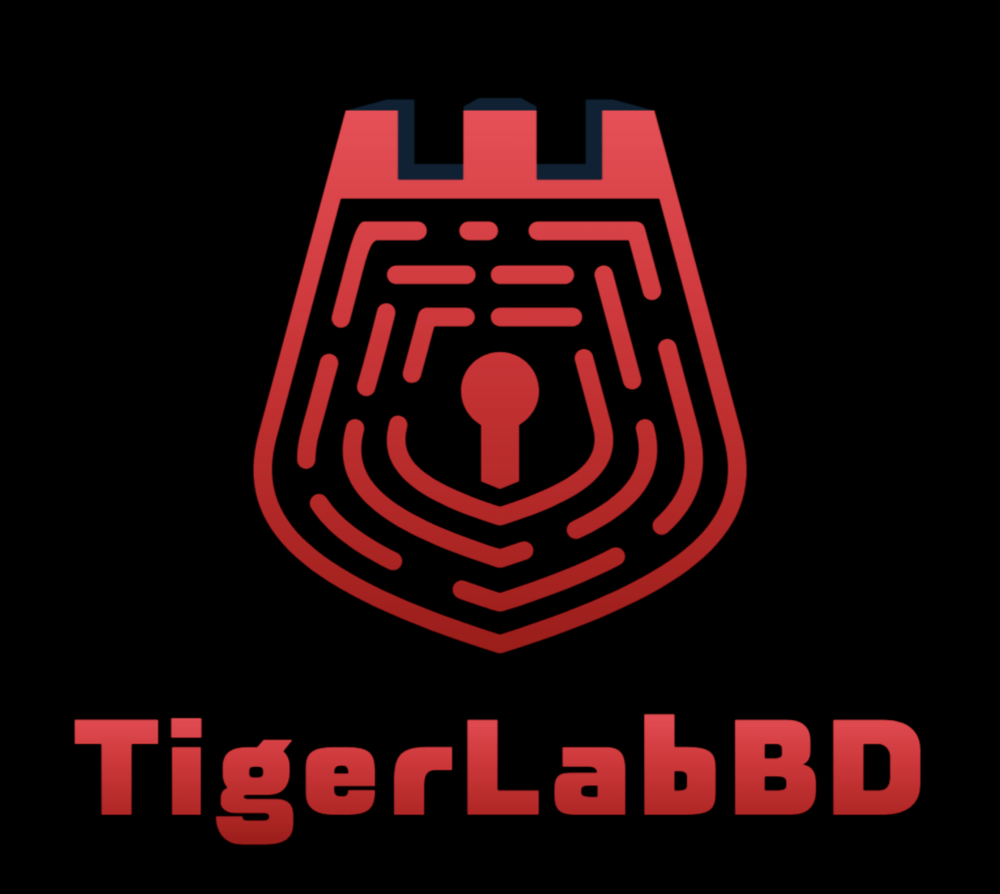

# TigerLabBD

### Bangladesh Cybersecurity & CTF Training Platform

A modern, beginner-friendly Capture The Flag (CTF) training platform designed to help users learn cybersecurity through hands-on challenges and competition.

This project was built for the **CSE 3100 Web Development Project**.

## Key Features
- **Registration and Dual Login**: Sign up and login via username or email.
- **Dynamic Challenges**: Solve tasks across categories like Web, Crypto, and Pwn.
- **Live Leaderboard**: Compete with others and track your ranking in real-time.
- **Community Submissions**: Submit your own challenges for admin review.
- **Admin Dashboard**: Full control over challenge approval and user management.

## Languages and Technologies
- **Python** (Django Framework)
- **HTML5 and CSS3** (Bootstrap 5)
- **JavaScript**
- **SQL** (Postgres / SQLite)
